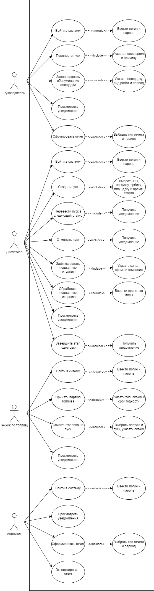
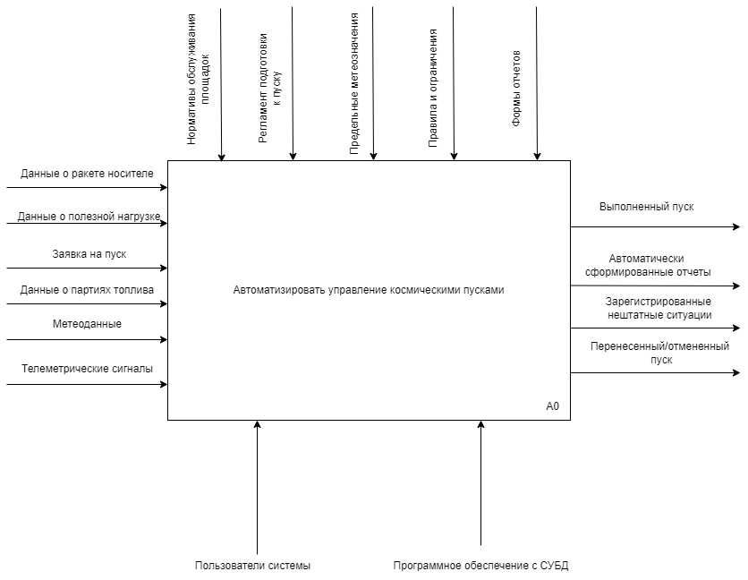
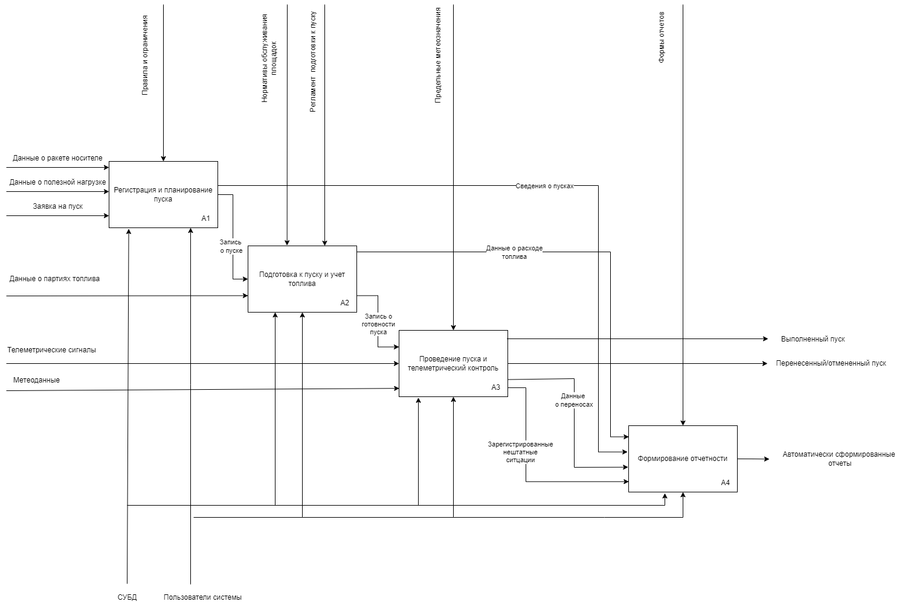
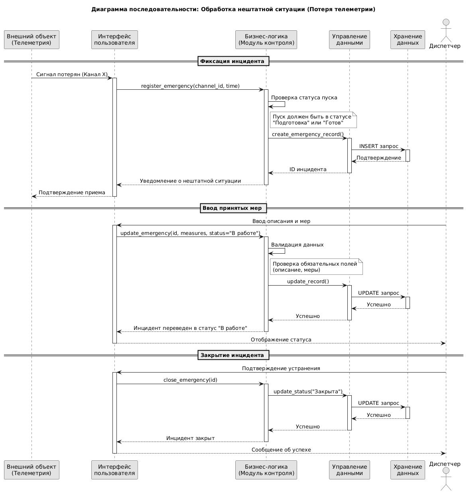
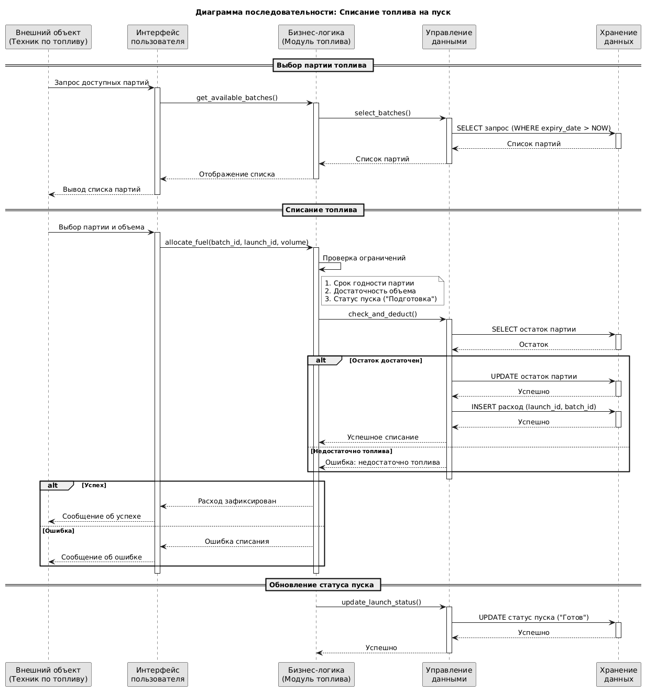
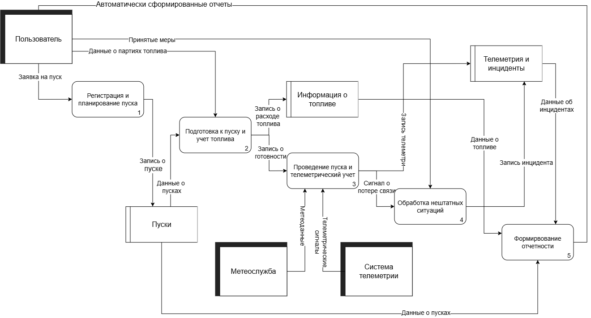
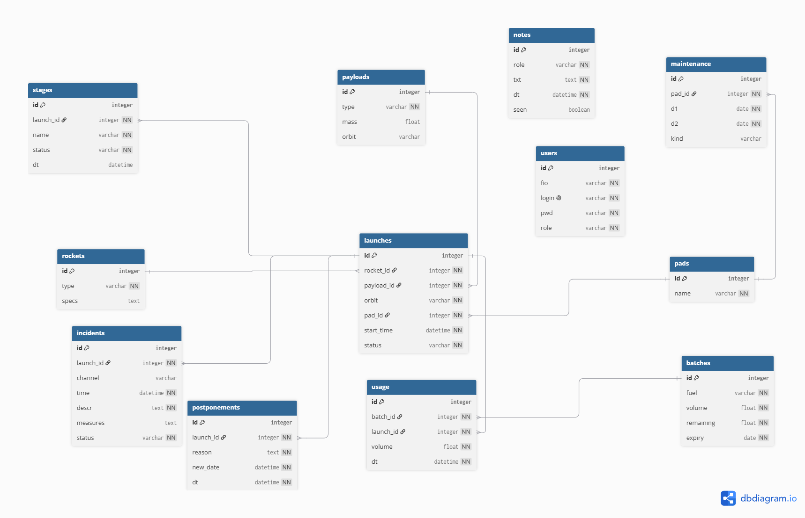

# Space-Launch-Control-Center
# 1. **Сущности системы:**
- ракета-носитель;
- этап подготовки;
- обслуживание;
- пуск;
- стартовая площадка;
- партия топлива; 
- расход топлива;
- нештатная ситуация;
- пользователь.
# 2. **Процессы системы:**
- регистрация пуска;
- подготовка к пуску;
- телеметрический контроль;
- учет топлива;
- проведение пуска;
- обработка нештатных ситуаций;
- перенос пуска;
- формирование отчетности.
# 3. **Роли пользователей**
- РУКОВОДИТЕЛЬ (АДМИНИСТРАТОР) может просматривать все разделы, переносить пуски, формировать отчеты; 
- ДИСПЕТЧЕР может создавать и редактировать пуски, вести этапы подготовки, фиксировать нештатные ситуации;
- ТЕХНИК ПО ТОПЛИВУ может принимать партии топлива, контролировать сроки годности, списывать расходы;
- АНАЛИТИК может просматривать данные, формировать отчеты без права изменения записей.
# 4. **Правила и ограничения:**
# **Пуски**
- Обязательные поля: ракета-носитель, полезная нагрузка, орбита, время старта, статус.
- Статусы пуска: запланирован -> подготовка -> готов -> выполнен / перенесен / отменен.
- Пуск проходит все этапы подготовки последовательно.
# **Топливо**
- Партия с истекшим сроком годности к использованию не допускается.
- Расход топлива фиксируется только с привязкой к пуску и партии.
# **Стартовые площадки**
- Площадка не может быть занята двумя пусками одновременно.
- Пока идет обслуживание - площадка недоступна для новых пусков.
# **Нештатные ситуации**
- Обязательные поля: время, описание, принятые меры, статус.
- Статусы: открыта -> в работе -> закрыта.
- Потеря сигнала по каналу фиксируется как нештатная ситуация.
# **Перенос пуска**
- Перенос оформляется только с указанием причины.
# 5. **Отчетность**
- пуски по типам ракет-носителей (содержит количество пусков по каждому типу за период) в виде таблицы;
- расход топлива (содержит объем израсходованного топлива по партиям и пускам) в виде таблицы;
- нештатные ситуации (содержит список инцидентов с причинами и мерами) в виде таблицы;
- переносы пусков (содержит количество переносов с указанием причин) в виде таблицы
- загрузка стартовых площадок (содержит количество подготовок и пусков на каждую площадку за период, а также занятость по времени) в виде таблицы.

# **UseCase-диаграмма**

  

# **Контекстная диаграмма в нотации IDEF0**

  

# **Диаграмма декомпозиции**

  

# **Диаграмма последовательности (Обработка нештатной ситуации)**

  

# **Диаграмма последовательности (Списание топлива на пуск)**

  

# **Диаграмма потоков данных DFD**

  

# **IDEF1X**

  

